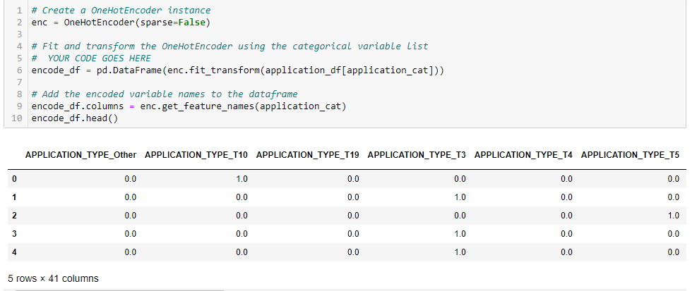
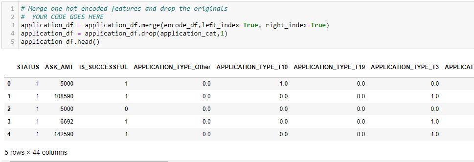
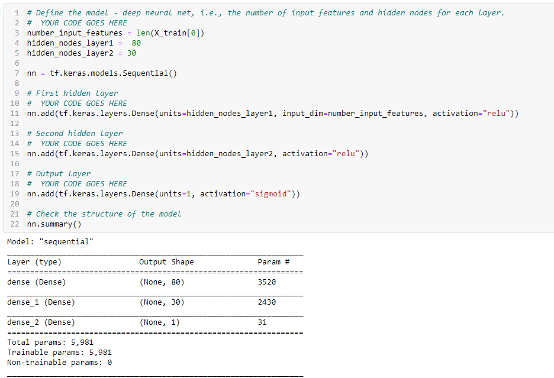
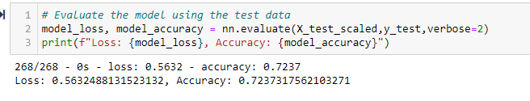

# Neural_Network_Charity_Analysis
## Overview of the analysis
The purpose of this project is to use the features in the provided dataset of the machine learning and neural network knowledge to help Beks create a binary classifier that is capable of predicting whether an organization will receive funding from Alphabet Soup. To be specific, Scikit learn and TensorFlow will be used to create a binary classification. 

## Results

### Data Preprocessing
Firstly, Bucketing or binning some the values to decrease the feature amount. Then, I need to preprocess the data by categorical data into numerical data by using the OneHotEncoder() module from sklearn. Finally, I merged the application_dataframe with the encode_dataframe and apply StandardScaler() function to normalized the data.
For this model, IS_SUCCESSFUL column is the target, EIN and NAME are neigher targets nor features, so those should be removed, and the rest of the columns are considered the feature. 

### Compiling, Training, and Evaluating the Model
How many neurons, layers, and activation functions did you select for your neural network model, and why?
Were you able to achieve the target model performance?
What steps did you take to try and increase model performance?
- Per the initial model from delivery 2, there are 2 hidden layers. The 1st hidden layer contains 80 neurons and the 2nd hidden layer has 30 neurons. Both hiddens layers used Rectifued Linear Unit(ReLU). Due to the binary nature of the results, as they would always be 0 or 1, output activation used a Sigmoid activation.
- For the initial model, an accuracy is 72.37%, which is a little bit lower than the target model performance (75%).
- To increase model performance, we can add the 3rd hidden layer, increase neurons amount of each hidden layer, apply different activation functions for the hidden layers, or adding or reducing the number of epochs to the training regiment.

## Summary
Summarize the overall results of the deep learning model. Include a recommendation for how a different model could solve this classification problem, and explain your recommendation.
In summary, accuracy performance can't reach at the target accuracy 75%, even though we add more layers and more neurons. Random forest probably will be more efficient for this analysis because 1).  Random forest classifiers are a type of ensemble learning model that combines multiple smaller models into a more robust and accurate model. 2). The dataset didn't include images, which is suitful for random forest model 3). Random forest run with less time compared with Deep learning.
